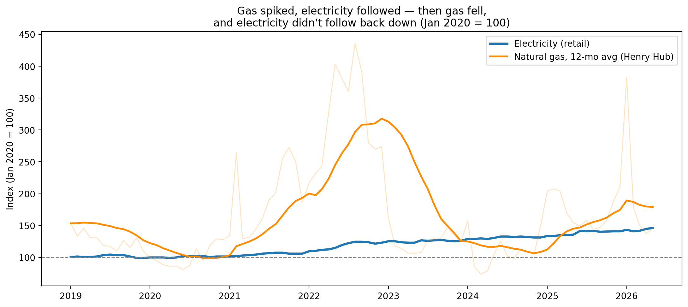
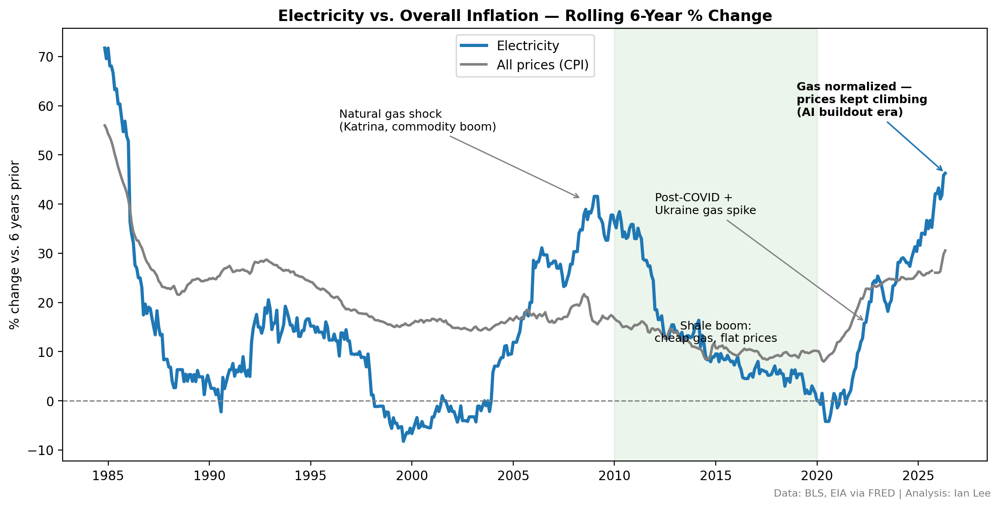
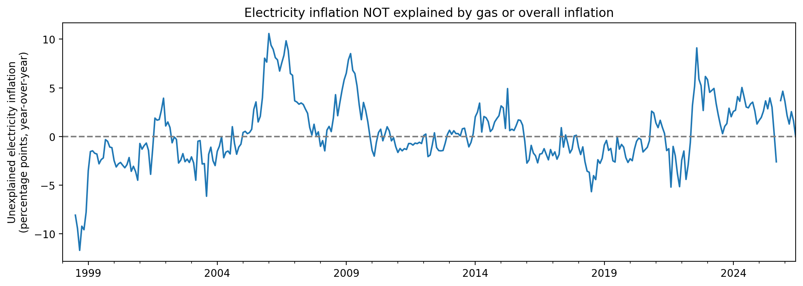

# Why Your Electric Bill Stopped Following Fuel Prices

Natural gas prices spiked in 2022 and then fell all the way back. Your electric bill went up — and stayed up. This is a data investigation into why, using 47 years of public US price data (1978–2026).

**The one-sentence version:** Electricity prices used to rise and fall with fuel costs. Around 2020 that link broke — fuel got cheap again but bills kept climbing — and the timing lines up with the surge in electricity demand from AI datacenters.

---

## The question

From 2014 to 2020, the average price of US electricity was basically flat. Then it took off — **up 46% since 2020.**

That kind of jump usually has a simple cause: the fuel that runs power plants got more expensive, or general inflation pushed everything up. So the question is straightforward: **is this just fuel and inflation, or is something genuinely new going on?**

To find out, I pulled the actual price history from public government data and worked through it step by step.

---

## Step 1: Electricity normally follows natural gas — but this time it didn't come back down

Most US electricity is generated by burning natural gas, so for decades the price of electricity tracked the price of gas. When gas got expensive, your bill went up a few months later. When gas got cheap, your bill eased off.

That first half still happened. Gas prices roughly **quadrupled** in 2022 (the post-COVID demand snap plus the war in Ukraine), and electricity dutifully followed it up.

Then gas did something dramatic: it gave the *entire* spike back. Gas is now **65% below its 2022 peak** — cheaper than before the crisis.

Electricity never followed it down. Since gas peaked in 2022, **gas has fallen 65% while retail electricity has risen another 17%.** The two lines used to move together; now they've split apart completely.



This is what I call a **ratchet**: prices climb when fuel goes up, but don't slide back when fuel comes down. Like a ratchet wrench, it only turns one way.

---

## Step 2: It's not just regular inflation either

The obvious next question: maybe electricity is just rising along with everything else — groceries, rent, cars. To check, I compared electricity against the overall cost of living (the Consumer Price Index, the standard measure of inflation) over the same period.

The chart below shows how much each has risen over rolling six-year stretches, going all the way back to the 1980s. The gray line is "everything"; the blue line is electricity.



A useful comparison is the early 1980s, when electricity famously spiked ~70%. That looks alarming until you notice *everything* was spiking then — it was just high inflation, and in real terms electricity barely moved.

Today is different. Electricity is now pulling clearly **above** the cost-of-living line. The current run-up is one of the steepest in the entire 47-year record, and it's outpacing general inflation — which the early-'80s spike never did. So "it's just inflation" doesn't hold up.

---

## Step 3: After subtracting fuel *and* inflation, there's a lot left over — and the timing is the story

Fuel and general inflation are real and they explain part of the rise. So I built a simple model that says: *given what gas and inflation were doing, here's what electricity prices "should" have been.* I taught the model using only the pre-2023 years — the era when fuel really was the main thing moving prices — and then asked it to explain recent years.

The gap between what the model expects and what actually happened is the part that **fuel and inflation can't explain.** Here's that gap over time:



For most of history that gap hovers around zero — meaning fuel and inflation explained things well. But starting around 2023 it lifts off and stays up: electricity has been running about **2.7 percentage points per year hotter** than fuel and inflation can account for, and it hasn't settled back down.

What changed around then? For the first time in roughly two decades, US electricity demand started growing again — driven largely by the **buildout of AI datacenters**, along with related grid upgrades and the cost of keeping the grid reliable as old power plants retire.

---

## What this does and doesn't prove

I want to be honest about the limits, because this is the part most charts skip:

- **This shows a pattern, not a courtroom-proof cause.** The "unexplained" gap is everything that isn't fuel or general inflation. That bundle includes datacenter demand, but also spending on grid infrastructure, power-plant retirements, and the broader electrification of cars and heating. I can't cleanly separate them with this data alone.
- **Gaps like this have appeared before** (notably 2005–2009) and faded within a couple of years. What's notable this time is that the gap is *persistent* and is attached to a cause — datacenter demand — that is still growing, not a one-off shock that fades.
- So the honest claim isn't "this is unprecedented." It's: **elevated, lasting, and tied to something that's still ramping up.**

---

## Reproduce it yourself

Everything here regenerates from public data — no API keys, no manual downloads. The numbers and charts in the notebook are pulled live from the Federal Reserve's FRED database each time it runs.

```bash
pip install -r requirements.txt
jupyter notebook electricity_analysis.ipynb   # then Run All
```

📓 Full analysis with all the code: [`electricity_analysis.ipynb`](electricity_analysis.ipynb)

**Data sources** (all via [FRED](https://fred.stlouisfed.org/)):

| What | Source |
|---|---|
| Average US electricity price, per kWh | Bureau of Labor Statistics |
| Consumer Price Index (overall inflation) | Bureau of Labor Statistics |
| Natural gas spot price (Henry Hub) | Energy Information Administration |

**Built with:** Python, pandas, matplotlib, statsmodels.

---

*Ian Lee, June 2026*
